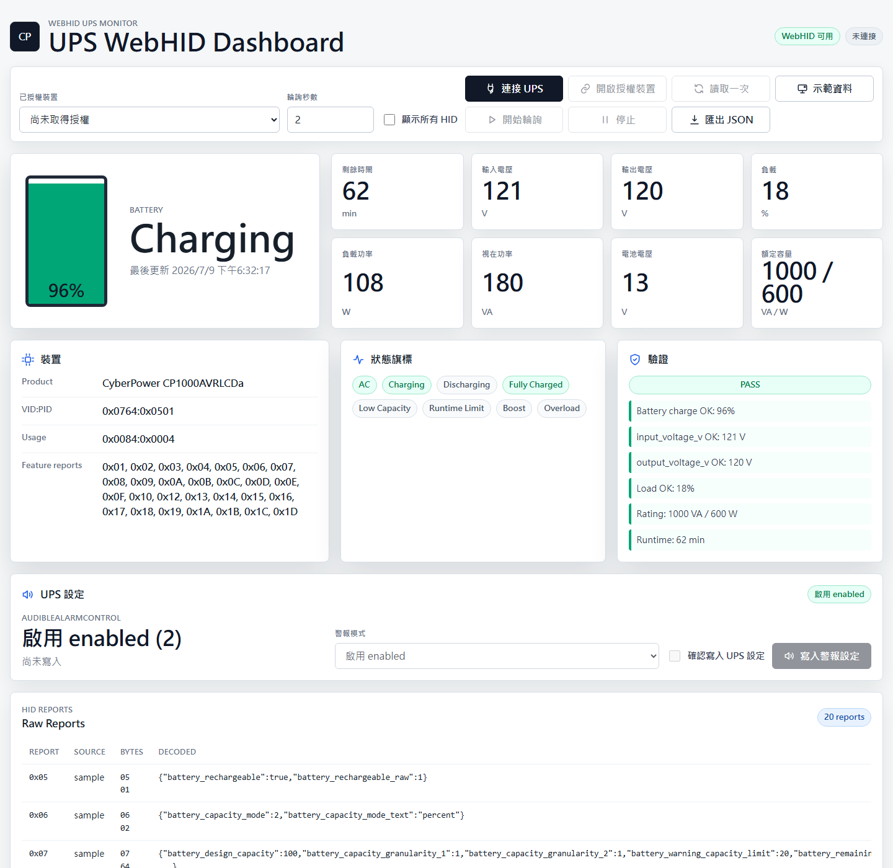

# UPS WebHID Dashboard

這是一個純網頁前端專案，透過瀏覽器的 WebHID API 直接讀取 UPS 的 USB HID feature reports，並用儀表板顯示電池、輸入/輸出電壓、負載、狀態旗標與 raw report。預設會尋找 HID Power Device / UPS usage，不再鎖定特定廠牌或 `0764:0501`。

English documentation is available in [README.en.md](README.en.md).

## 專案重點

- 純靜態前端，不需要 Python、Node.js、後端服務或 build step。
- 使用 WebHID `receiveFeatureReport()` 讀取 UPS 資料，並優先依裝置宣告的 feature report ID 自動讀取。
- 預設篩選 HID Usage Page `0x0084` / Usage `0x0004`，可支援不同廠牌與型號的 UPS。
- 已知相容的 CyberPower 裝置可寫入 `AudibleAlarmControl`，支援 `disabled`、`enabled`、`muted` 三種模式。
- 適合直接部署到 GitHub Pages 或任何靜態檔案主機。
- 支援沒有 UPS 時載入 `示範資料`，方便先檢查 UI。
- 圖示使用內嵌 SVG，不需要第三方前端套件或 CDN。

## 相容性

- 預設連線條件: HID Usage Page `0x0084` Power Device + Usage `0x0004` UPS
- 若裝置沒有正確宣告 UPS usage，可勾選 `顯示所有 HID` 後手動選取，再以 raw report 模式嘗試讀取。
- 已實機測試: CyberPower `CP1000AVRLCDa`，VID:PID `0764:0501`
- 不同 UPS 的 report ID 與資料格式可能不同；本工具會顯示可讀取的 raw reports，已知欄位會自動解析。

## 功能

- 從瀏覽器要求 UPS HID 權限
- 讀取已授權的 UPS 裝置
- 單次讀取或固定秒數輪詢
- 顯示電池百分比、剩餘時間、輸入電壓、輸出電壓、負載百分比、負載瓦數、VA、電池電壓與額定容量
- 顯示 AC、充電、放電、滿電、低容量、剩餘時間限制、Boost、Overload 等狀態
- 對已知相容裝置寫入 UPS 警報模式，並在寫入後讀回確認
- 顯示 raw HID report bytes 與已解析欄位
- 匯出目前快照為 JSON

## 畫面預覽

桌面版:



## 使用方式

此專案沒有安裝或編譯步驟。請用支援 WebHID 的 Chromium 系瀏覽器，例如 Chrome 或 Edge，透過安全來源開啟頁面:

- GitHub Pages 的 `https://` 網址
- `localhost` 上的任一靜態檔案伺服器

開啟頁面後按 `連接 UPS`，選取 UPS，即可讀取資料。若裝置沒有出現在清單中，可勾選 `顯示所有 HID` 再試一次。若要修改警報設定，需使用已知相容裝置，選擇模式、勾選確認，再按 `寫入警報設定`。若只是想先看畫面，可以按 `示範資料` 載入本機產生的範例 snapshot。

示範資料也可以直接用查詢參數開啟:

```text
docs/?demo=1
```

## GitHub Pages

本 repository 的 GitHub Pages 設定:

- Source: `Deploy from a branch`
- Branch: `gh-pages`
- Folder: `/`

`main` 分支中的原始靜態頁面放在 `docs/index.html`，發布用的 `gh-pages` 分支只包含同一份可直接瀏覽的靜態網頁。

## 隱私與安全

- WebHID 權限由瀏覽器管理，使用者必須手動選取裝置。
- 儀表板沒有後端服務，讀取到的資料只留在目前瀏覽器頁面中。
- 寫入功能僅在已知相容的 CyberPower-style `AudibleAlarmControl` report 上啟用，並需要使用者在畫面上勾選確認。
- `示範資料` 是本機產生的範例 snapshot，不會存取硬體。
- `.editorconfig` 和 `.gitattributes` 已設定 UTF-8 與 LF 換行，方便中文 README 在 GitHub 與不同編輯器中穩定顯示。

## 已知 CyberPower HID report 對照

| Report ID | 資料 |
| --------: | ---- |
| `0x05` | Rechargeable flag |
| `0x06` | Battery capacity mode |
| `0x07` | Design capacity, full charge capacity, capacity limits |
| `0x08` | Battery capacity and runtime |
| `0x09` | Configured voltage |
| `0x0A` | Battery voltage |
| `0x0B` | UPS status flags |
| `0x0C` | Audible alarm setting, readable/writable |
| `0x0E` | Input configured voltage |
| `0x0F` | Input voltage |
| `0x10` | Low/high transfer voltage |
| `0x12` | Output voltage |
| `0x13` | Load percent |
| `0x14` | Self-test status |
| `0x15` | Shutdown delay countdown |
| `0x16` | Startup delay countdown |
| `0x17` | Boost and overload status |
| `0x18` | Rated power |
| `0x19` | Load watts |
| `0x1D` | Load VA |

## 專案結構

```text
.editorconfig
.gitattributes
docs/
  index.html
  assets/css/styles.css
  assets/img/dashboard-desktop.png
  assets/js/app.js
  assets/js/cyberpower-hid.js
README.md
README.en.md
```

## Windows 疑難排解

如果無法找到或開啟 UPS:

1. 關閉 PowerPanel 或其他可能佔用 UPS 的軟體。
2. 重新插拔 USB 線，並確認 Windows 裝置管理員能看到 UPS。
3. 在 Chrome 或 Edge 重新整理網頁，再按一次 `連接 UPS`。
4. 若裝置仍未出現，請確認頁面是從 `https://` 或 `localhost` 開啟。

## 參考文件

- [MDN WebHID API](https://developer.mozilla.org/en-US/docs/Web/API/WebHID_API)
- [MDN HID.requestDevice()](https://developer.mozilla.org/en-US/docs/Web/API/HID/requestDevice)
- [MDN HIDDevice.receiveFeatureReport()](https://developer.mozilla.org/en-US/docs/Web/API/HIDDevice/receiveFeatureReport)
- [Chrome for Developers: Connect to uncommon HID devices](https://developer.chrome.com/docs/capabilities/hid)
